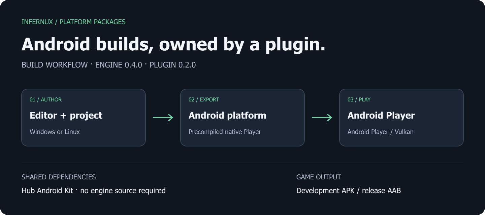

# Android 平台

为 ARM64 设备和 x64 模拟器构建 Android Player。插件拥有目标注册、预编译原生 Player、SDL 宿主文件和 APK/AAB 导出。大型可复用依赖归 Hub 的安卓兼容套件管理，不放进每个项目。

## 构建前准备

安装 Infernux 0.4.0、Hub 安卓兼容及完整 Android 平台插件。插件包含 ARM64/x86_64 预编译 Player 库和 SDL Java 宿主文件。普通 APK/AAB 导出不需要引擎源码、Git 子模块、CMake 或宿主 pybind11。

## 共享依赖

先在 **Hub → 安装** 中安装**安卓兼容**。共享套件就绪前，编辑器的导入按钮保持禁用；不会等到导入或构建时才下载 SDK。套件从 Hub 发布渠道独立分发，不包含在此插件的 Release 中；发布插件不代表同步发布了套件。

当前套件包括 JDK 17、Gradle 8.12、Android API 36、build-tools 36.0.0、NDK 29.0.14206865，以及两个 ABI 的 Android CPython 3.13 运行时。模拟器和 AVD 不属于真机构建所需内容。

## 构建与安装

真机选择 android-arm64，x64 模拟器选择 android-x64-emulator。开发构建默认输出 APK，发布构建默认输出 AAB。Player 要求 Vulkan，不提供 OpenGL ES 兜底；应用最低 API 为 26。

开发 APK 可使用 `adb install -r path/to/game.apk` 安装。更新已安装游戏必须使用兼容的签名密钥；不要为绕过签名不一致直接卸载用户游戏。

## 签名与存储

未配置签名时，发布 AAB 保持未签名状态。设置 INFERNUX_ANDROID_KEYSTORE、INFERNUX_ANDROID_KEY_ALIAS、INFERNUX_ANDROID_KEYSTORE_PASSWORD，以及可选的 INFERNUX_ANDROID_KEY_PASSWORD（默认等于 keystore 密码）。不要提交密钥和密码。

Gradle 缓存归 Hub 的 Shared/Cache/Gradle 管理，独立源码启动则使用项目 Cache/Gradle。调试签名状态使用 Shared/State/Android 或项目 State/Android。清缓存不能删除签名密钥；显式设置的 GRADLE_USER_HOME 和 ANDROID_USER_HOME 优先。

## 排错

导入按钮禁用表示 Hub 安卓兼容尚未安装或不完整。先处理 SDK、CPython、Gradle 或插件载荷缺失诊断，确认插件制品匹配引擎 0.4.0。如果 Hub 渠道尚未发布兼容套件，仅安装此插件无法替代它。
